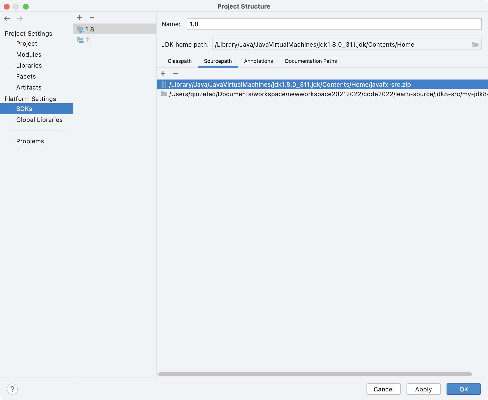

主要一些 JDK 的基本特性，以及一些基本源码的介绍

设置项目的源码路径如下：

# 已完成

- jdk 源码常用类的注释
- Arrays

  - 二分(有比较器)
  - copyOfRange
- ArrayList变量区分：size，index，elementData

  初始化：三个

  add 扩容 复制 溢出处理

  remove System.arrayCopy

  iterator remove会修改期望的modCount, 不匹配快速失败（并发修改异常）
- LinkedList
  ----------
- HashMap
- AQS

# 待完成
